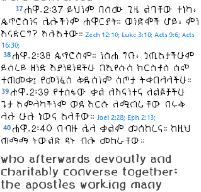

# Geez_Gofa_C



**Geez_Gofa_C** is a modern Ethiopian (Ge'ez / Amharic) typeface designed in Light weight (200).

## Styles Included

- Normal Plain  
- Condensed Plain  
- Expanded Plain  
- Normal Oblique  

## Available Formats

- OTF  
- TTF  
- WOFF2  

## Live Demo

View the full character comparison here:  
[→ Open Font Comparison](https://debessay.github.io/Gofa_amharic_fonts/geez-full-compare.html)

## Installation

### Desktop
1. Download the font files or the zip (`Geez_Gofa_C_200.zip`)
2. Install the `.otf` or `.ttf` files on your computer

### Web (Recommended)
Use the free jsDelivr CDN:

```css
@font-face {
  font-family: 'Geez_Gofa_C';
  src: url('https://cdn.jsdelivr.net/gh/debessay/Gofa_amharic_fonts@main/Geez_Gofa_C_200_regular_normal_plain.woff2') format('woff2');
  font-weight: 200;
  font-style: normal;
  font-display: swap;
}
