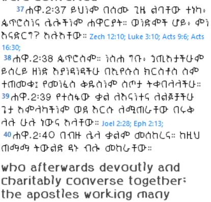

# Geez_Gofa_C

A free Ge'ez and Amharic typeface in four styles, designed by [Aklilu Debessay](https://github.com/debessay).

**[Open the specimen site](https://debessay.github.io/Gofa_amharic_fonts/)** · **[Download all styles](Geez_Gofa_C_200.zip)** · [SIL Open Font License 1.1](OFL.txt)



Geez_Gofa_C is a rounded, pen-drawn sans for Ge'ez (Ethiopic) and Latin. Version 1.000. It is not a variable font: each style is a separate file, in OTF, TTF, and WOFF2. The file names use the series label 200.

The normal style installs as **Geez_Gofa_C Regular** (weight 400). Condensed and expanded use their own family names. The oblique style is the italic of Geez_Gofa_C.

## Styles and downloads

| Style | Name in the font menu | Files |
| --- | --- | --- |
| Normal | Geez_Gofa_C Regular | [OTF](Geez_Gofa_C_200_regular_normal_plain.otf) · [TTF](Geez_Gofa_C_200_regular_normal_plain.ttf) · [WOFF2](Geez_Gofa_C_200_regular_normal_plain.woff2) |
| Condensed | Geez_Gofa_C Light Cond | [OTF](Geez_Gofa_C_200_regular_condenced_plain.otf) · [TTF](Geez_Gofa_C_200_regular_condenced_plain.ttf) · [WOFF2](Geez_Gofa_C_200_regular_condenced_plain.woff2) |
| Expanded | Geez_Gofa_C Light Exp | [OTF](Geez_Gofa_C_200_regular_expanded_plain.otf) · [TTF](Geez_Gofa_C_200_regular_expanded_plain.ttf) · [WOFF2](Geez_Gofa_C_200_regular_expanded_plain.woff2) |
| Oblique | Geez_Gofa_C Oblique (italic of Geez_Gofa_C) | [OTF](Geez_Gofa_C_200_regular_normal_Oblique.otf) · [TTF](Geez_Gofa_C_200_regular_normal_Oblique.ttf) · [WOFF2](Geez_Gofa_C_200_regular_normal_Oblique.woff2) |

[Download all four styles (zip)](Geez_Gofa_C_200.zip)

## Install

### Windows

1. Download an `.otf` or `.ttf` file, or the zip.
2. Double-click the font and choose **Install**. You can also right-click it and choose **Install**, or **Install for all users**.
3. Restart any app that was already open. The family name is **Geez_Gofa_C**.

### Mac

1. Download an `.otf` or `.ttf` file.
2. Double-click it. Font Book opens. Click **Install Font**.
3. Condensed and expanded are separate families: **Geez_Gofa_C Light Cond** and **Geez_Gofa_C Light Exp**.

### iPhone and iPad

iOS will not install a loose font file from the Files app. Download the `.otf` or `.ttf`, then install it with a font app such as AnyFont or Fontcase, or with a configuration profile. It then appears in apps that allow custom fonts, including Pages and Keynote.

### Android

Download the `.ttf`. Some phones can apply a custom font from Settings → Display. Many cannot. If that setting is not there, install the file with a font app. It is then available in apps that let you pick a typeface.

### On the web

Normal and oblique share the family name `Geez_Gofa_C`. Use `font-style: italic` for the oblique. Condensed and expanded keep the family names stored in the files. The normal face is weight 400, so `font-weight: normal` matches it.

```css
@font-face {
  font-family: "Geez_Gofa_C";
  src: url("https://cdn.jsdelivr.net/gh/debessay/Gofa_amharic_fonts@main/Geez_Gofa_C_200_regular_normal_plain.woff2") format("woff2");
  font-weight: 400;
  font-style: normal;
  font-display: swap;
}
@font-face {
  font-family: "Geez_Gofa_C";
  src: url("https://cdn.jsdelivr.net/gh/debessay/Gofa_amharic_fonts@main/Geez_Gofa_C_200_regular_normal_Oblique.woff2") format("woff2");
  font-weight: 400;
  font-style: italic;
  font-display: swap;
}
@font-face {
  font-family: "Geez_Gofa_C Light Cond";
  src: url("https://cdn.jsdelivr.net/gh/debessay/Gofa_amharic_fonts@main/Geez_Gofa_C_200_regular_condenced_plain.woff2") format("woff2");
  font-weight: 300;
  font-style: normal;
  font-display: swap;
}
@font-face {
  font-family: "Geez_Gofa_C Light Exp";
  src: url("https://cdn.jsdelivr.net/gh/debessay/Gofa_amharic_fonts@main/Geez_Gofa_C_200_regular_expanded_plain.woff2") format("woff2");
  font-weight: 300;
  font-style: normal;
  font-display: swap;
}
```

To host the files yourself, download the WOFF2 files and replace each address with your own path.

## Characters

651 characters: 550 in the Ethiopic blocks (Ethiopic, Ethiopic Supplement, Ethiopic Extended, and Ethiopic Extended-A), plus Latin.

The specimen site has a syllabary chart. For every character beside Noto Sans Ethiopic, with its Unicode value, open the [full comparison](https://debessay.github.io/Gofa_amharic_fonts/geez-full-compare.html).

## Monospace companion

[Geez_Gofa_mono_C](https://github.com/debessay/Geez_monospace_font) is a monospace font for Ge'ez, Amharic, and Latin, with 578 characters, also under the SIL Open Font License 1.1. [Download v1.0](https://github.com/debessay/Geez_monospace_font/releases/tag/V1.0).

## License

Geez_Gofa_C is free to use, study, modify, and share, including in commercial work. Do not sell the font files by themselves. A modified version needs its own name. The reserved font names are **Geez_Gofa_C** and **Geez_Gofa**.

The full text is in [OFL.txt](OFL.txt). The license FAQ is at <https://openfontlicense.org>.

Copyright 2026 Aklilu Debessay.

## Questions

Found a missing or odd character? [Open an issue](https://github.com/debessay/Gofa_amharic_fonts/issues).
